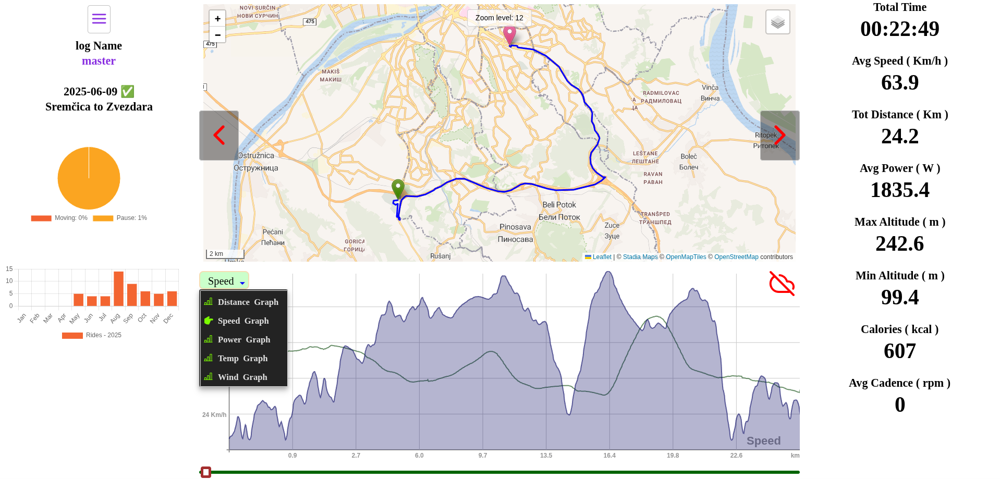
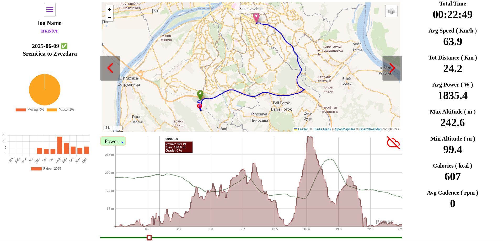
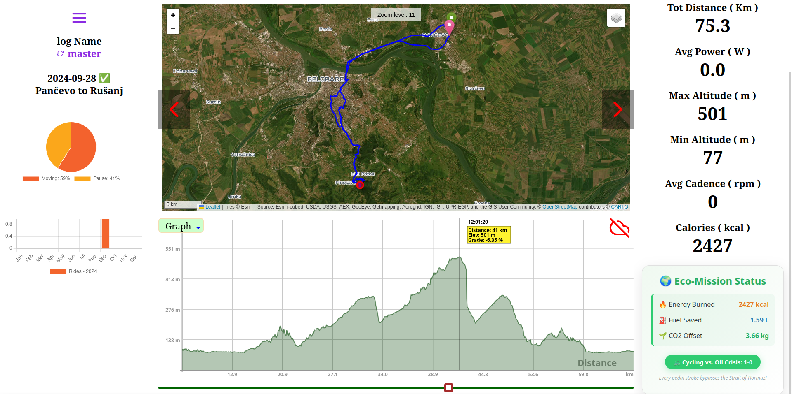
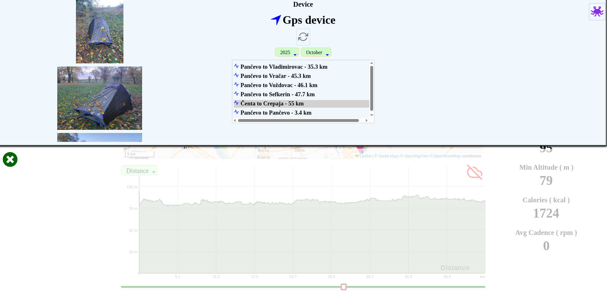

# Cycle Power Web Dashboard

**Cycle Power Web** is the analytical frontend for the Cycle Power ecosystem. It allows cyclists to visualize, analyze, and manage their ride data (generated by the Cycle Power Mobile app) directly in any modern web browser.

> [!TIP]
> **Experience the Power of JavaFX on the Web:** This entire dashboard is written in Java and compiled to highly optimized JavaScript.

---

## ⚡ Powered by WebFX

The most unique aspect of this project is that it is built using **[WebFX](https://webfx.dev/)**.

WebFX is a revolutionary toolchain that allows developers to:

* **Use JavaFX Code:** For UI logic and components ( Minor Java Script usage for IndexDB ).
* **GWT Compilation:** Leverages the GWT (Google Web Toolkit) compiler to turn Java code into standard JavaScript.
* **No Plugins:** No Java plugin or WebAssembly required; it runs natively in the browser's DOM.
* **High Performance:** Smooth animations and responsive charts, all managed through Java's robust type system.

---

## 🚀 Key Features

* **Data Visualization:** Beautiful, interactive charts showing speed, cadence, and power metrics.
* **FIT to JSON Analysis:** Seamless integration with the Spring Boot backend to process and display standard cycling `.fit` files.
* **Unified UI:** A consistent look and feel with the mobile app, powered by the **AtlantaFX** theme system adapted for the web.
* **Responsive Design:** Optimized for both desktop and tablet browsers.

---

## 🛠 Tech Stack

* **Java 17+**
* **[WebFX](https://github.com/webfx-project/webfx):** Cross-platform JavaFX-to-JS compiler.
* **Spring Boot (Backend):** Handles file uploads and data parsing.
* **GWT (Google Web Toolkit):** Under-the-hood transpilation.

---

## 📸 Screenshots

   

   

   

   

## 🌐 Live Demo

Check out the live dashboard here:

👉 **[Cycling Power Web - Live on Render](https://cyclingpower-web.onrender.com)**

*(Note: Hosted on Render's free tier. If the page doesn't load immediately, please allow ~30 seconds for the backend instance to wake up.)*

---

## 📂 Related Projects

This repository is part of a larger ecosystem:

1. **[Cycle Power Mobile](https://github.com/CommonGrounds/CyclingPower_Mobile):** The GluonFX-based mobile app for recording rides.
2. **[Cycle Power Backend](https://github.com/CommonGrounds/CyclingPower_Server):** The Spring Boot server that manages data and FIT file conversion.